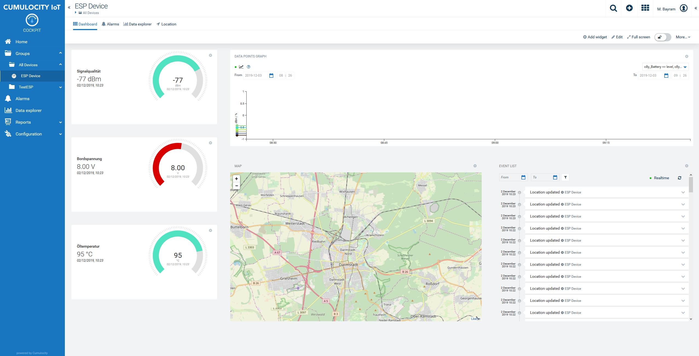

# Cumulocity Example on how to trigger Events with an Amazon Dashbutton for a Smart Kanban System
This is an example for sniffing data packages inside a network and filtering connection packages. This can be used e.g. to make Amazon Dashbuttons trigger Events and thus whole actions in Cumulocity.
In this example I used an Amazon  Dashbutton, since they are cheap and easy to use (see section). The Event how ever can be used as a Smart Kanbas inside a storage system as a real industrial IoT example.
However any other device registartion can be used such as iPhones within a network or Laptops. Some manufactures due to energy saving reasons deactivate the connection to the wireless network such that a "new" device within the network might not be "new" within the network. Be carefull!

You can use the APAMA Analytics Builder to create rules around the incoming event such as Alarming or measurement creation.

Cumulocity is an IoT platform that enables rapid connections of many, many different devices and applications. It allows you to monitor and respond to IoT data in real time and to spin up this capability in minutes. More information on Cumulocity IoT and how to start a free trial can be found [here](https://www.softwareag.cloud/site/product/cumulocity-iot.html#/).

Cumulocity IoT enables companies to to quickly and easily implement smart IoT solutions.

______________________
For more information you can Ask a Question in the [TECHcommunity Forums](http://tech.forums.softwareag.com/techjforum/forums/list.page?product=webmethods-io-b2b).

You can find additional information in the [Software AG TECHcommunity](http://techcommunity.softwareag.com/home/-/product/name/webmethods-io-b2b).
______________________

These tools are provided as-is and without warranty or support. They do not constitute part of the Software AG product suite. Users are free to use, fork and modify them, subject to the license agreement. While Software AG welcomes contributions, we cannot guarantee to include every contribution in the master project.

Contact us at [TECHcommunity](mailto:technologycommunity@softwareag.com?subject=Github/SoftwareAG) if you have any questions.

## KANBAN System

Kanban is commonly used as an inventory scheduling system that allows productions to keep only needed components on stock. In Lean manufacturing the technique is used to keep inventory levels as low as possible. Material is pulled within the process through the production since the Kanban system provides the signal for reordering into the stock.

A Kanban system allows a company to reduce their level of inventory. This reduces the cost associated with stocking and storing materials. Using a Kanban system in a lean environment allow actual customer demand to determine the need for materials and not forecasts of the demand.

A company can use one of several methods to signal stock replenishment with a Kanban system. For example, colored bins or reorder cards are methods that signal it is time to repurchase materials or parts. In most of the cases the signal is analog and no digital trigger is used. However this requires a very consequent check of the Kanban cards. Here comes the idea of a fast and easy triggering event via a button into play that triggers the purchasing process.

The appropriate level of material needs to be adjsuted to prevent stock outs. The lead-time for parts and materials from vendors is a factor in determining the optimum level of inventory. The organization may adjust the Kanban levels several times before finding the best quantity of material to keep on hand for production or distribution. Therefore a digital system together with the generated data on site could significantly improve the adjustment speed, even in short term optimizations such as holidays or overproduction.

## Amazon Dashbuttons

There are plenty of smart buttons on the market but none was as cheap as the dash buttons from Amazon. Actually there were meant to be used to trigger orders directly from Amazon.
Since the button itself connects to the wireless network the ARP request combined with the known MAC ID of the Button can be used to detect that the button was pressed. The button itself only connects if pressed.
From pressing to getting the connection request within the script usually there is a latency of around 1-2 s.
If you use an Dashbutton, make sure not to allow its communication outside the network. Otherwise Amazon will ship you quite a lot of orderings :-)
Within the FritzBox and probably any other router you can prohibit the communication for specific devices.

## Getting Started

Getting stated is much easier on linux than on windows since some of the sniffing libraries only work on unix natively.

### Prerequisites

1. Wifi Security -> Don´t do this with wildcard MAC files and open Wifi´s, don´t do open Wifi at all :-)
2. Install scapy -> pip install scapy
3. Install pandas -> pip install pandas
4. Install jsonify -> pip install jsonify
5. Install configparser -> pip install configparser
6. Install Paho MQTT -> pip install paho-mqtt

Make sure to use python3 and not python 2! Additionally you need to user sudo!

### Daemon service

The service can run as a daemon service in order to keep it up and running in the background. There is a shell script provided to copy service and application into the correct directory. Make sure to run it as root.

## Code structure

Basically there are 4 major tasks:

1. Listening on a network for new devices -> Listener
3. If a devices registers inside the network mapped against c8y_Serial of the Idneity Service -> Mapper
2. If a proper device was detectect, do something -> Event class
4. Result needs to be send to C8Y -> sendData

Debugger is set to Info in every module, this makes debugging a lot easier. Change if you want.

### Listener

The listener class actually consists of nothing but a sniffer that searchs for the request of a new device within the network. If it receives an ARP request within the network it uses the source of this for calling the Event class.
In case of an valid event, which is if the source MAC addres is also listed in the csv file, an Event is created and send via MQTT.

Since a device could possibly create multiple requests (e.g. signal strenght or leaving and entering a certain area) it might be reasonable to create something like a dead time on a later stage.

### Event class
The Event class handles the incoming request event within the network.
Therefore it uses the mapper class to check whether the source of the request comes from a device that is listed wihtin the MACID.csv.

The event is send as standard template as 'c8y_MAC_Event' combined with the name in the whitelist file and the MAC address.

### Mapper

The mapper checks the request from inventory API.

1. Check whether the Mac address is listed as external ID in Cumulocity. If a managed object with the MAC address as c8y_Serial exists, the device is valid for sending events

Sine ":" characters are split within the mqtt clientid the cy_Serial needs to be without ":", otherwise it will not recognice the device properly.

### sendData

The sendData modul consists of two  major classes.
One is the sending class itself in order to manage the sending of a current event.
The second one is the connector  that manages the topic, the client ID of the device and keeps the connection until data was send. The valid connector needs to be handed over to the sending class. It gets its credentials and connection data from the config file and does not require to give addtional information while creating the instance.

### MACIDs

The idea of the parameterfile is to have a proofing instance of which parameters will be handeled. The structure is basically only the name of the parameter.

### config

The config file is the main configuration file to adjust all the required parameters wihtin the runtime.

  [C8YMQTT]
  1. tenant = This is the tenant URL that should display the data
  2. tenantID = Your can get your Tenant ID from your administrator, it starts with "t", e.g. t1231231235
  3. user = Tenat User start with your ID and a backslah, followd by user, e.g. t2131324124/myuser
  4. port = In this example the unsecure 1883 port is used. We recommend to use 8883 together with SSL.
  5. password  = Password of the user

